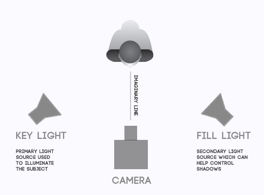
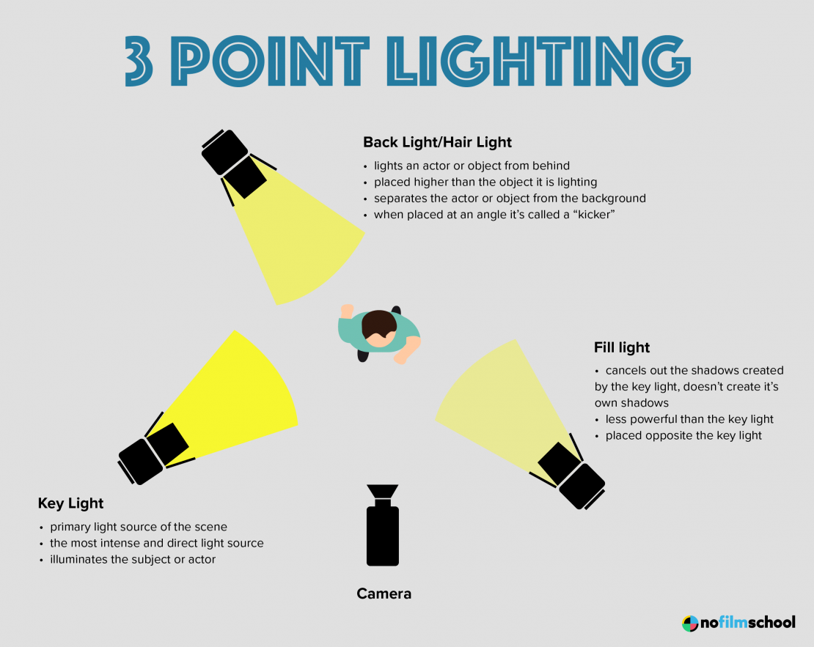
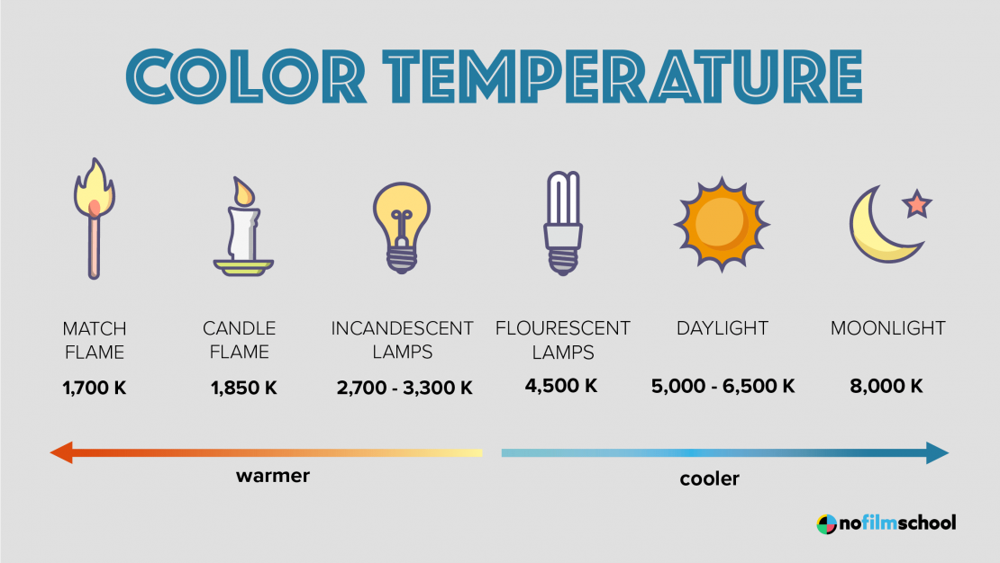
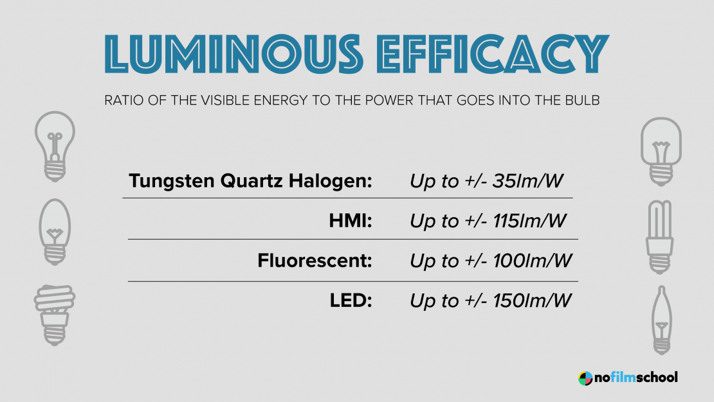
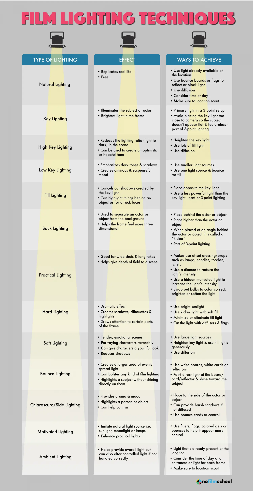

# Film light ans lighting for film | 06.03.2023

A comprehensive collection of crucial information regarding cinematic lighting and lights used on film sets

## **Sources**

* [Types of Film Lights (and How to Use Them)](https://nofilmschool.com/types-of-film-lights)
* [Types of Lights Used in Film](http://www.magnumco.com/the-ultimate-guide-to-film-lights/)

## **Infographics**

### 1. **Two point light setup**

### 2. **3 point lighting**

### 3. **Color temperature**

### 4. **Luminous efficacy**

### 5. **Film lighting technique**

