# Save the cat - Story beats

Since Snyder’s sheet was originally created for screenwriting, the bracketed number by each beat is the page or pages that it would take up of a standard **110-page screenplay**. The beats are as follows:

## 1. **Opening Image `[1]`**

### An opening snapshot

* This is a snapshot that instantly introduces us to the present world of the hero. (Can establish an overarching message)

  **Example: `"Interstellar"`**

  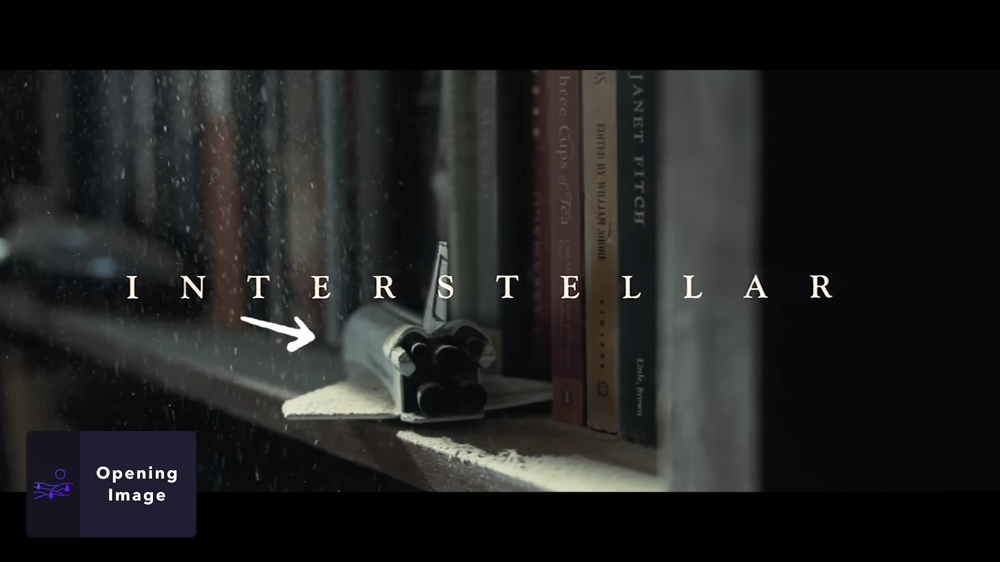

  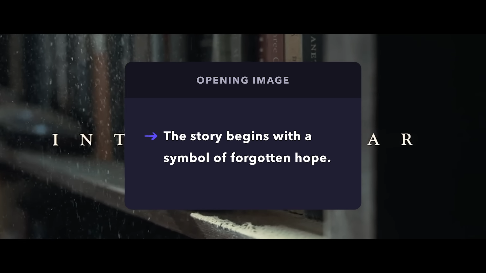

  A model space shuttle sitting on a bookshelf edge. Books, shelf and the model covered in brown dust. Dust particles in the air visibly inluminated by a nearby window.

  Dorment immage for:

  * hope (Humanity escaping doom/extinction into space),
  * personal forlorne desire (Cooper's and Humanity's dreams of space exploration)  

      Counterpoint to the finall image.

---

## 2. **Theme Stated `[5]`**

### We are introduced to the central theme or lesson of the story

* This beat introduces the central idea, or life lesson, that the hero will discover over the course of the story.

  **Example: `"Interstellar"`**

  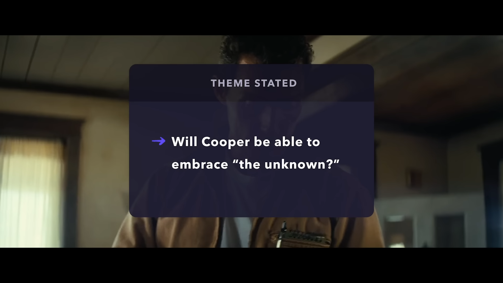

  * Murph states: **"You said science was bout admitting what we don't know."**

  * Cooper is presented as a strict scientific mind. **Will he be able to accept a non-scientific method as a solution to a problem?** (even when it comes preventing human extinction)

---

## 3. **Set Up `[1-10]`**

### The hero and the 'ordinary world' are introduced

* Here comes a deeper, more detailed look at the status quo of the hero’s world, before it is violently shaken up. Crucial details about the **character flaws** they might be working to overcome will show up here too.

* We meet our hero and see why we should root for them (**save the cat moment**).
* Hero's world is established: challanges both external (environment / wants) and internal (falws / needs).

  **Example: `"Interstellar"`**

  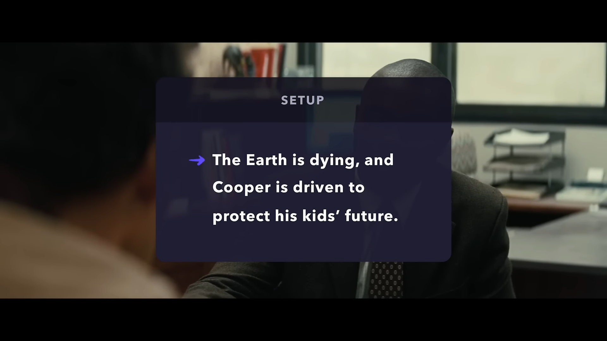

  * External:

    * **Earth is crisis** (dust storms, crops dying out)
    * Earth on verge of famine -> more farmers needed -> **Cooper's son will not be going to college**

  * Internal:

    * Cooper's absolute belief in science -> want's to save his children's future with the help of science

  * **"Save the cat"** for Cooper: want to fight for his kids' better future

---

## 4. **Catalyst `[12]`**

### Something happens that sets the story in motion

* Also known as the **inciting incident** in other structures, this major plot pointis the single moment that sets the hero on the course they will pursue over the story.

  **Example: `"Interstellar"`**

  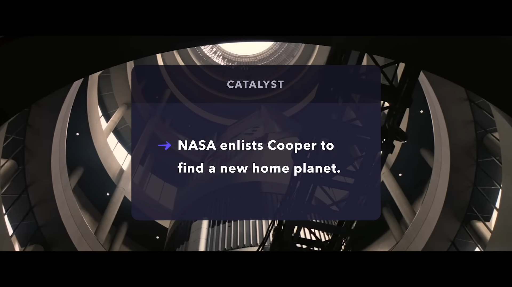

  * Cooper story is set in motion when Nasa enlists him to help save Humanity. (Test of Will Cooper's faith in science save human race and he's children with it)

---

## 5. **Debate `[12-25]`**

### The hero is hesitant to take action

* Following the catalyst, the hero resists the challenge presented by the inciting incident.

  **Example: `"Interstellar"`**

  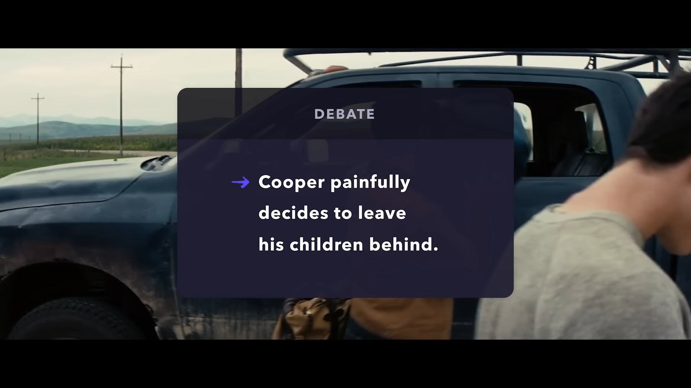

  * Cooper's internal struggle to leave he's kids in the process of saving them

---

## 6. **Break Into Two `[25]`**

### The hero takes up the challenge

* After their moment of doubt, the hero decides to take on the challenge that’s been thrown their way and sets about dealing with the fall-out of the inciting incident.

* Transition to act two.

  **Example: `"Interstellar"`**

  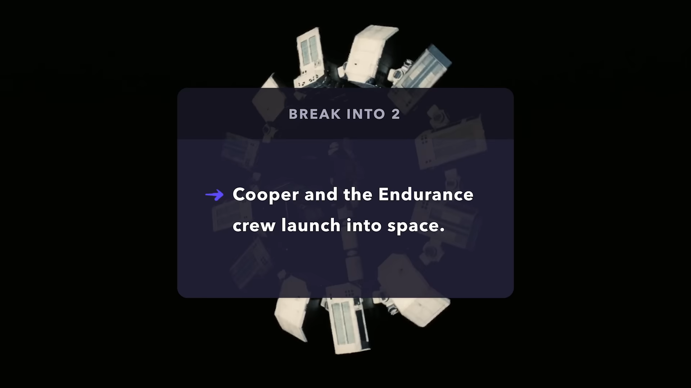

  * Cooper departs on the Endurance

---

## 7. **B Story `[30]`**

### The subplot kicks in, introducing a character who helps the hero in their transformation

* The B story, or subplot, is introduced fairly early and continues to run alongside the main plot for most of its duration. The B story usually involves a character (romantic interest / mentor / foil) who’s integral to helping the hero undergo their transformation.

  **Example: `"Interstellar"`**

  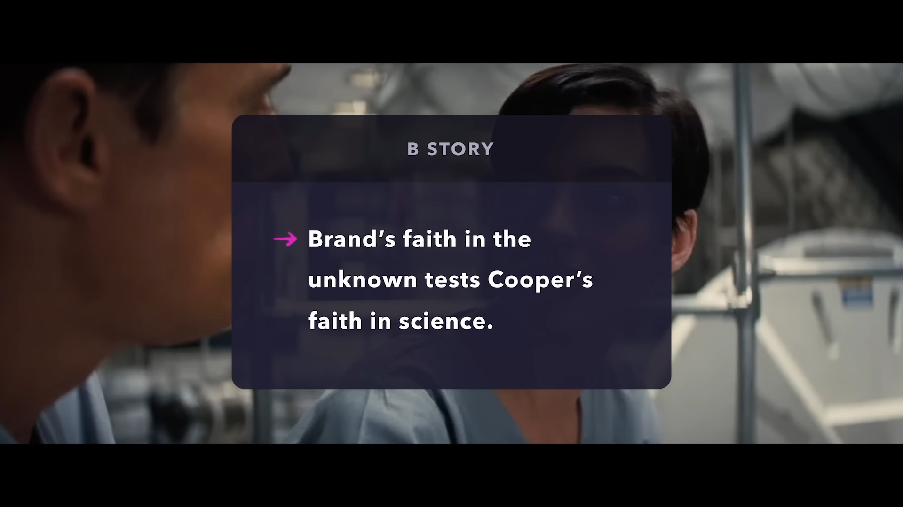

  * Doctor Brand is established as Cooper's philosophical rival

---

## 8. **Fun and Games `[30-55]`**

### The hero in the throes of their challenge or journey

* Despite the label, this beat might not actually entail any fun for the characters involved, and is also often referred to as the **‘promise of the premise’**. Here is where that action or central conflict that was promised, often in the hook of the story description, is delivered on.

* Hero explores the world.

* In a superhero story, this is where we get to see them beat up some low-level bad guys; in a detective story, **'fun and games'** is where the gumshoe will start tracking down some clues.

  **Example: `"Interstellar"`**

  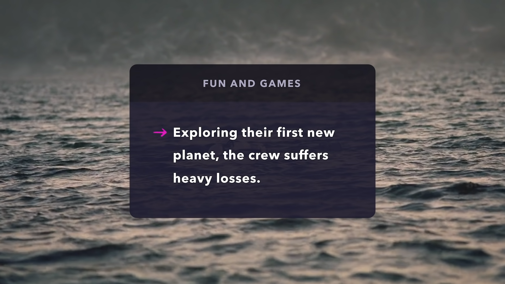

  * Endurance's crew lands on Miller's planet (explores new world). Crew suffers heavy losses - the mission tyrns out more difficult than it seemed.

---

## 9. **Midpoint `[55]`**

### The stakes are raised

* This point signals the culmination of the action of the ‘fun and games’. Stakes are raised by a plot twist that likely takes the form of a false victory — a moment where the hero mistakenly believes they have won

* Point of no return. False victory or false defeat.

  **Example: `"Interstellar"`**

  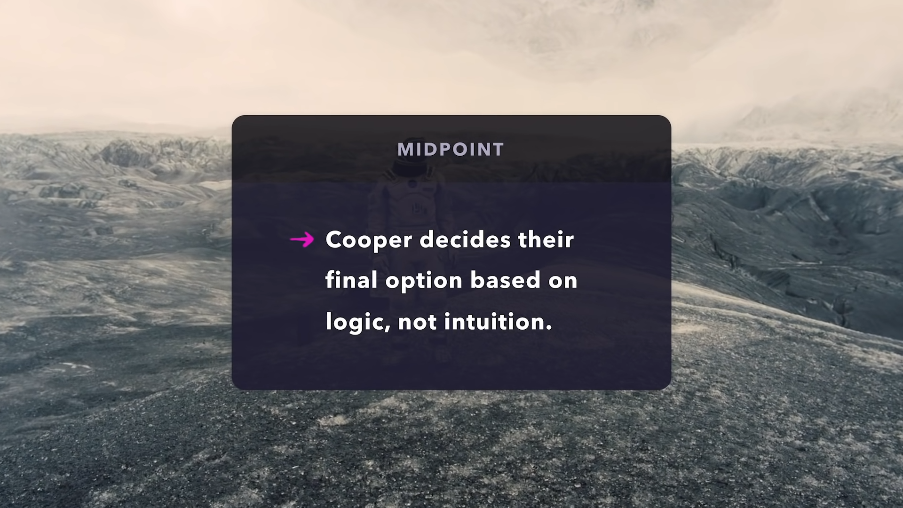

  * Point of no return.
  * Cooper nearly escapes death. He comes back on Endurace finding the time diolation costed him 22 year of his chilred's life. They are all grow up now.
  * Endurance crew has to bet on a planet. The lack the fuel to visit two worlds.

---

## 10. **Bad Guys Close In `[55-75]`**

### Things start going downhill for the hero

* In the wake of the midpoint, tension mounts and **things really start to go downhill for the hero.**

* Hero faces antagonistic forces

  **Example: `"Interstellar"`**

  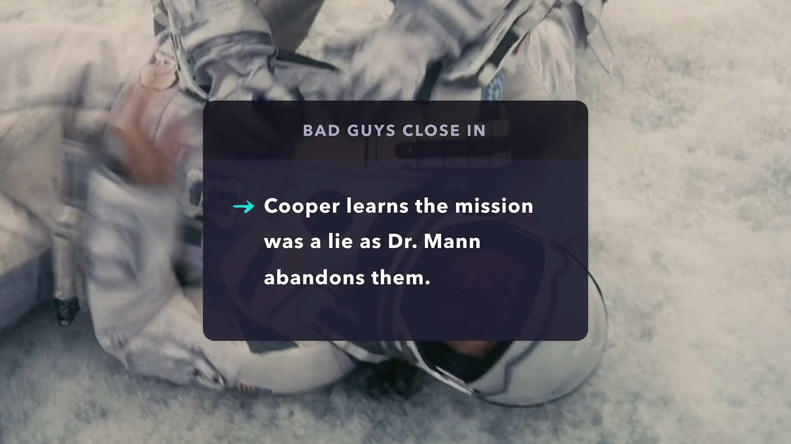

  * **Internal:** Cooper's decision to abandon his children to garantee their better future turns out to be a lie. He's children are stuck on Earth. They are going to die. 
  * **External:** Endureance's crew is betrayed by selfish Dr. Mann.

---

## 11. **All is Lost `[75]`**

### Things go from bad to worse. The hero hits rock bottom

This is the moment where everything comes crashing down for the hero and they reach rock bottom, where all hope seems lost.

  **Example: `"Interstellar"`**

  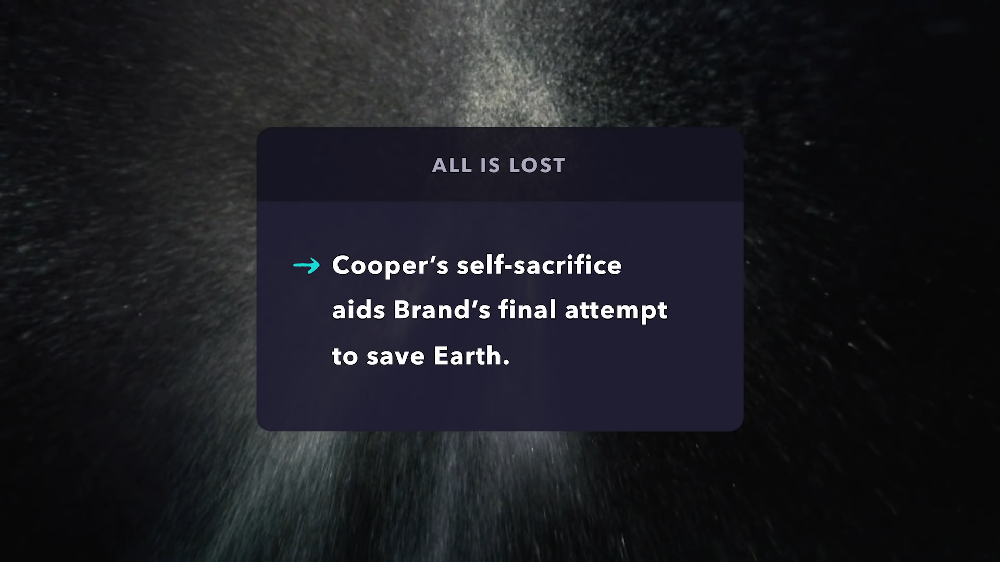

  * Cooper realizes at this point in he's journey, he has no logical solution to the problem of comming back to he's children. They will die of old age before he can reach them, and there isn't enough resources in the space ship to get back to earth anway.

---

## 12. **Dark Night of the Soul `[75-85]`**

### Faced with defeat, the hero must reckon with their loss and how they got there

* In the face of defeat, the hero has a moment of reckoning where they take stock of what they have lost.

  **Example: `"Interstellar"`**

  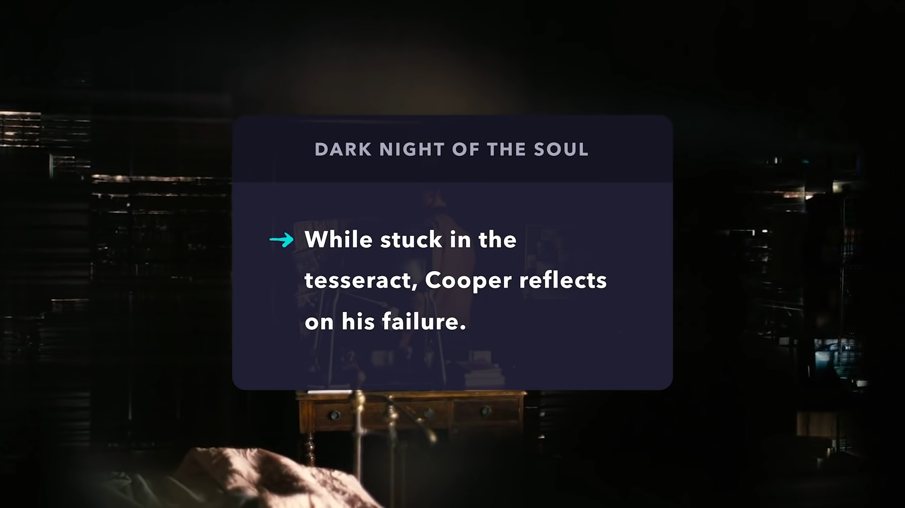

  * Cooper's sacriface puts him inside the tesseract (a mesterious construct where time is represented as a phicical dimention)
  * Cooper is forced to relive he's greatest mistake - leaving his children to go on the false mission

---

## 13. **Break Into Three `[85]`**

### The hero realizes a truth that’s been evading them all this time

* Through their emotional despair, the hero will find the motivation to keep going thanks to what they have learned over the course of their journey and from the B-Story. With their new optimism and resolution to keep pushing on, the hero springs into action with a new, improved approach to tackling the struggle they are facing.

  **Example: `"Interstellar"`**

  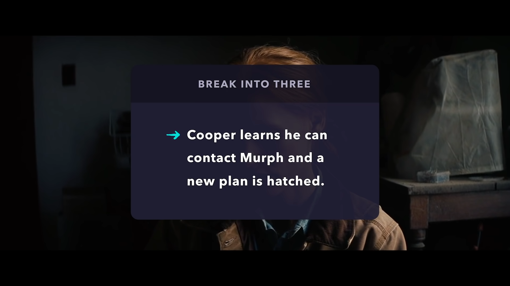

  * Cooper realizes he can communicate with the past through gravity.
  * Even though he does not fully understand how the newfound solution works Cooper is going to do whatever he can (even use the unexplained tesseract) to save his children.

---

## 14. **Finale `[85-110]`**

### Putting their new awareness into action, the hero conquers the bad guys

* The hero overcomes the problems they were facing with the help of their newly discovered truth.

* Five distinct sub-beats:

  * **GATHER A TEAM `[86]`:**
    * hero gathers a team to face the opposing forces once again
  * **EXECUTE THE PLAN `[92]`:** 
    * new plan is executed
  * **HIHG TOWER SUPRISE `[95]`:**
    * the plan fails once again
    * or something unexpected happens
  * **DIG DEEP DOWN `[101]`:**
    * the protagonist is forced to "dig deep down" himself to overcome an obstacle
  * **EXECUTE A NEW PLAN `[106]`:**
    * protagonist executes a new plan

  **Example: `"Interstellar"`**

  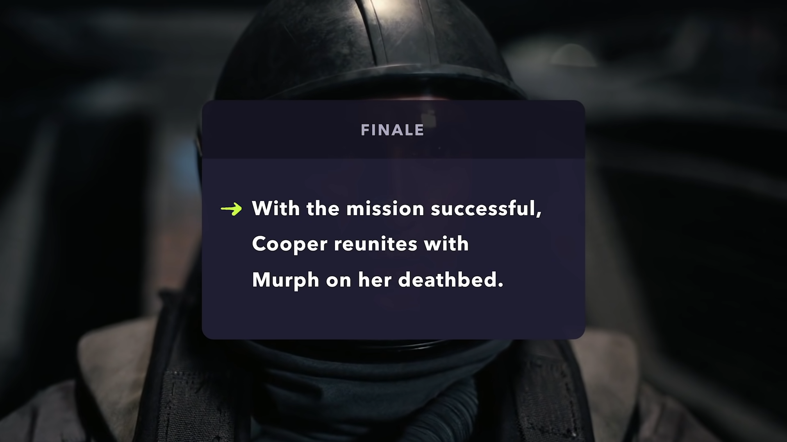

  * **Gather a team:**
    * Cooper enlists the help of T.A.R.S. to help communicate data to Murph
  * **Execute the plan:**
    * Murph successfully decodes the data and Cooper is ejected out of the Tesseract
  * **High tower suprise**:
    * Cooper is rescued
    * reconects with he's daughter
    * He's doaughter is on her daeth bed
  * **Dig deep down:**
    * Cooper has to "dig deep down" - find the inner strength to leave once again ("A parent shouldn't watch he's child death")
  * **Execute a new plan:**
    * Cooper flyes to meet with Dr. Brand on Edmund's planet

---

## 15. **Final Image `[110]`**

### A snapshot that mirrors or contrasts the opening image

* This final moment gives a clear impression of the transformation that has taken place in the hero’s life, and will often mirror the opening image.

  **Example: `"Interstellar"`**

  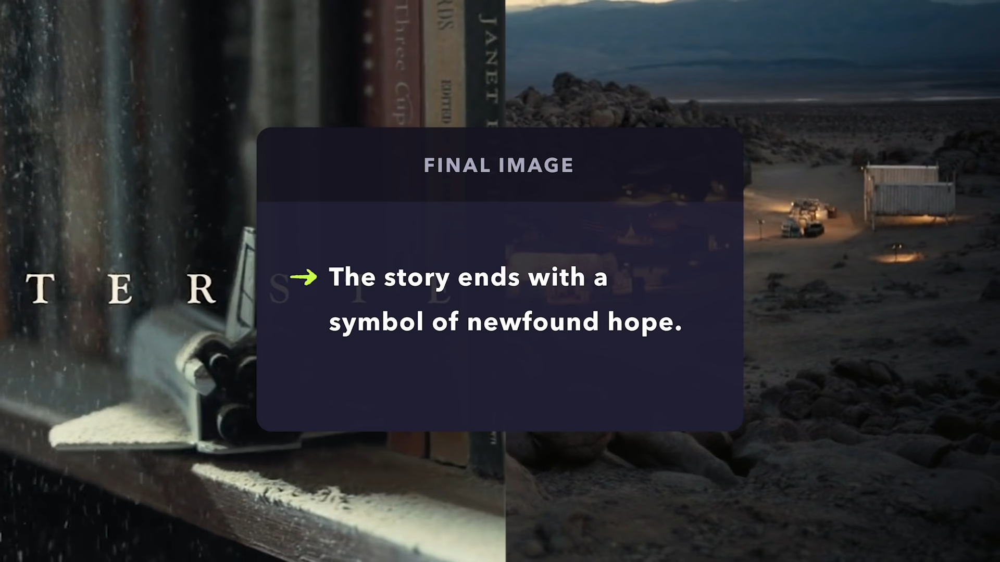

  * We close on Dr. Brand setting up a collony on Edmun'd planet - image of new found hope for humanity